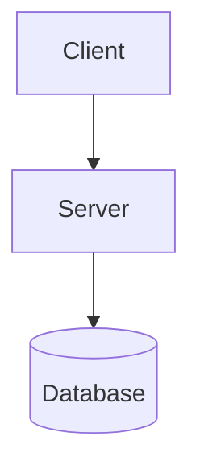

# Stark

A minimal Hugo blog theme with practical enhancements. Based on [hugo-bearblog](https://github.com/janraasch/hugo-bearblog).

Live demo: [jimyag.com](https://jimyag.com)

## Features

- Table of Contents — fixed sidebar on wide screens (>1400 px), floating button + slide-up modal on narrow screens
- Full-text search — client-side, no external service, `Ctrl/Cmd+K` or the Search button in the nav
- Mermaid diagrams — fenced code block with `mermaid` language tag; click to open zoomable lightbox (scroll wheel, drag, keyboard shortcuts)
- Image lightbox — click any image in a post to preview with zoom controls
- Code copy button — appears on hover over any highlighted code block
- Code block language label — language name shown in top-left corner of each code block
- Reading progress bar — 3 px bar at the top of the viewport
- Back to top button — appears after scrolling 300 px
- Math rendering — MathJax loaded automatically only on pages that contain `$...$` or `\(...\)` expressions
- Enhanced SEO — canonical URL, Open Graph, Twitter Card, schema.org structured data (WebSite, Person, BlogPosting, BreadcrumbList)
- Auto image optimization — local images resized to max 1200 px width and converted to WebP at build time
- Year-grouped post list with pinned posts at the top, pagination support
- Prev/Next post navigation at the bottom of each post
- Related posts section at the bottom of each post (matched by tags)
- Word count, estimated reading time, and last modified date in the post header
- Callout and details shortcodes
- Analytics — Plausible and Google Analytics 4 (opt-in, no script injected unless configured)
- i18n — English and Chinese built-in, extensible to any language
- Dark mode — automatic, follows system preference

## Installation

```bash
git submodule add https://github.com/jimyag/stark.git themes/stark
```

Set the theme in `hugo.toml`:

```toml
theme = "stark"
```

## Configuration

A full working example is in [`exampleSite/hugo.toml`](exampleSite/hugo.toml). The annotated reference below covers every supported option.

```toml
baseURL = "https://example.com"

theme      = "stark"
title      = "ᕕ( ᐛ )ᕗ My Blog"
copyright  = "Copyright © 2024, Your Name."
languageCode = "zh-CN"

enableRobotsTXT = true

# Suppress unused taxonomy pages; required for clean tag URLs
disableKinds = ["taxonomy"]
ignoreErrors = ["error-disable-taxonomy", "warning-goldmark-raw-html"]

[permalinks]
blog = "/posts/:slug/"
tags = "/blog/:slug"

# Search requires a JSON output on the home page
[outputs]
  home = ["HTML", "RSS", "JSON"]

[[menu.main]]
  name   = "RSS"
  url    = "/index.xml"
  weight = 2

[params]
description      = "A minimal blog about software engineering"
favicon          = "images/favicon.png"   # path under /static
images           = ["images/share.png"]   # default OG share image
dateFormat       = "2006-01-02"           # Go time format
hideMadeWithLine = false                  # set true to hide footer credit
# ogLocale       = "zh_CN"               # defaults to "en_US"

[params.author]
  name  = "Your Name"
  email = "you@example.com"   # used in RSS <managingEditor>

# Social links for schema.org Person structured data
[params.social]
  github        = "your-github-username"
  # stackoverflow = "https://stackoverflow.com/users/..."
  # twitter       = "your-twitter-handle"

[markup]
  [markup.goldmark]
    [markup.goldmark.renderer]
      unsafe = true   # allow raw HTML in Markdown
  [markup.highlight]
    style              = "monokai"
    lineNos            = true
    lineNumbersInTable = true
    codeFences         = true
    guessSyntax        = true
    noClasses          = true
  [markup.tableOfContents]
    startLevel = 2
    endLevel   = 4
```

## Content Structure

```
content/
├── _index.md          # home page body (Hugo renders .Content here)
├── blog/
│   ├── _index.md      # blog section (title = "Blog")
│   └── my-post/
│       ├── index.md   # post content (page bundle)
│       └── image.png  # local image — auto-optimized to WebP
└── friends.md         # any extra page; add to menu via front matter
```

### Home Page

`content/_index.md` is rendered as the body of the home page. Use it for a bio, project table, or any Markdown content:

```markdown
+++
title = ""
+++

# Hi, I'm Your Name

Software engineer. Write about Go, Kubernetes, and systems engineering.
```

### Extra Menu Pages

Add any standalone page to the nav by setting `menu = "main"` and `weight` in the front matter:

```markdown
+++
title   = "Friends"
menu    = "main"
weight  = 2
+++
```

## Post Front Matter

```yaml
---
title: "Post Title"
description: "One-sentence summary used in meta tags and the search index."
date: 2024-06-01T12:00:00+08:00
slug: "post-slug"          # controls the URL: /posts/post-slug/
tags: ["go", "linux"]
pinned: false              # set true to pin to the top of the list
weight: 1                  # lower weight appears first among pinned posts
---
```

All fields except `title` and `date` are optional.

## Features In Detail

### Search

Search is built client-side from a JSON index generated at build time. It requires no external service. Open with the Search button in the nav or `Ctrl/Cmd+K`. Results are scored by title (10×), tags (5×), and content (1×), top 10 shown.

Requires the JSON output on the home page:

```toml
[outputs]
  home = ["HTML", "RSS", "JSON"]
```

### Pinned Posts

Set `pinned: true` in a post's front matter. Pinned posts appear above the year-grouped list. Use `weight` to control ordering among pinned posts (lower = higher in the list).

### Mermaid Diagrams

Use a fenced code block with the `mermaid` identifier. The Mermaid JS library is loaded only on pages that contain at least one diagram.

````markdown

````

Click a rendered diagram to open the lightbox. Keyboard shortcuts inside the lightbox: `+`/`-` to zoom, `0` or Space to reset, `Escape` to close.

### Math

Inline: `$E = mc^2$`

Block:

```markdown
$$
\int_{-\infty}^{\infty} e^{-x^2} dx = \sqrt{\pi}
$$
```

MathJax is injected into the `<head>` only on pages that contain math expressions (detected by scanning `.RawContent` for `$`, `\(`, or `\[`).

### Table of Contents

The TOC is generated automatically from headings within the range set in `[markup.tableOfContents]` (default h2–h4). It is only shown when the rendered TOC is longer than 100 characters.

- Screen width > 1400 px: fixed sidebar to the left of the content
- Screen width ≤ 1400 px: floating "目录" button (bottom-right) opens a slide-up modal

### Image Lightbox

All images inside `<main content>` get a click handler. Clicking opens a fullscreen overlay with zoom-in/zoom-out buttons. Keyboard: `+`/`-` to zoom, `Escape` to close.

Local images in page bundles are automatically processed: resized to a max width of 1200 px and converted to WebP with `loading="lazy" decoding="async"`.

### Related Posts

At the bottom of each post, up to 6 posts that share at least one tag are shown as "相关文章". This section is hidden if there are no tag matches.

### Dark Mode

The theme follows the OS/browser `prefers-color-scheme` preference. No toggle is provided; switching is handled automatically.

### Prev/Next Post Navigation

Each post page shows navigation links to the previous and next post within the same section (ordered by date). The links appear below the related posts section.

### Last Modified Date

If a post's `lastmod` date (set via git or explicitly in front matter) differs from its `date`, a "Last modified" line is shown below the reading time.

To enable automatic `lastmod` from git commit history, add to `hugo.toml`:

```toml
[frontmatter]
  lastmod = ["lastmod", ":git", "date"]
```

### Reading Progress Bar

A 3 px bar at the top of the viewport shows reading progress on every page. It fills as the user scrolls and updates in real time.

### Code Block Language Label

A small language label (e.g. `go`, `bash`) is shown in the top-left corner of every syntax-highlighted code block. It reads the `data-lang` attribute set by Hugo's Chroma highlighter.

### Callout Shortcode

```markdown

Informational note. Markdown is supported.



A helpful tip.



Something to be cautious about.



Critical warning.

```

Available types: `note` (default), `tip`, `warning`, `danger`.

### Details Shortcode

```markdown

Hidden content revealed on click.

```

### Pagination

Set `pagerSize` in `hugo.toml` to control the number of posts per page (Hugo v0.128+ syntax):

```toml
[pagination]
  pagerSize = 20
```

Pinned posts are always shown in full on every page and are not included in the paginator.

### Analytics

Plausible:

```toml
[params.analytics]
  plausible = "yourdomain.com"
```

Google Analytics 4:

```toml
[params.analytics]
  googleAnalyticsId = "G-XXXXXXXXXX"
```

Both can be set at the same time. Neither script is injected unless the corresponding key is present.

### i18n

The theme ships with English (`en`) and Chinese (`zh-CN`) translations. To use English:

```toml
languageCode = "en-US"
defaultContentLanguage = "en"
```

To add another language, create `i18n/<code>.toml` in your site (not the theme) and translate the keys from `i18n/zh.toml`.

## Credits

- [hugo-bearblog](https://github.com/janraasch/hugo-bearblog) by Jan Raasch (MIT)
- [Bear Blog](https://bearblog.dev) by Herman Martinus

## License

MIT
