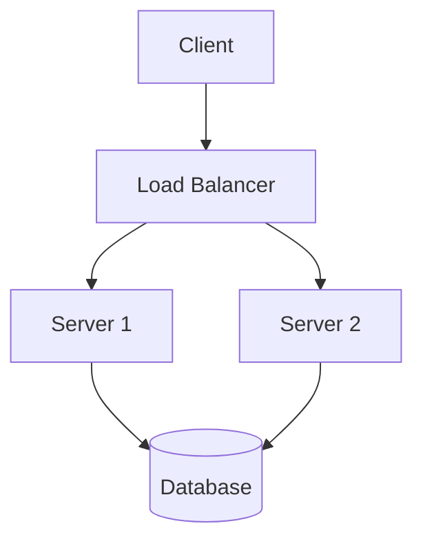

This post demonstrates all features supported by the Stark theme.

## Code Block

Syntax highlighting with line numbers and a copy button:

```go
package main

import "fmt"

func main() {
    fmt.Println("Hello, World!")
}
```

## Mermaid Diagram

Click any diagram to open a zoomable lightbox (scroll wheel to zoom, drag to pan):



## Math

Inline math: $E = mc^2$

Block math:

$$
\int_{-\infty}^{\infty} e^{-x^2} dx = \sqrt{\pi}
$$

Math is rendered with MathJax, loaded only on pages that contain math expressions.

## Image

Local images are automatically resized and converted to WebP:


Click the image to open the lightbox preview.

## Table

| Feature | Status |
|---------|--------|
| TOC | Sidebar on wide screens, modal on narrow |
| Search | Client-side, no external service |
| Mermaid | Click to zoom |
| Math | MathJax, auto-detected |
| Image lightbox | Click to preview |
| Code copy | Hover over code block |

## Table of Contents

The TOC is generated automatically from headings (h2–h4 by default). On screens wider than 1400 px it appears as a fixed sidebar. On narrower screens a floating "目录" button opens a slide-up modal.
